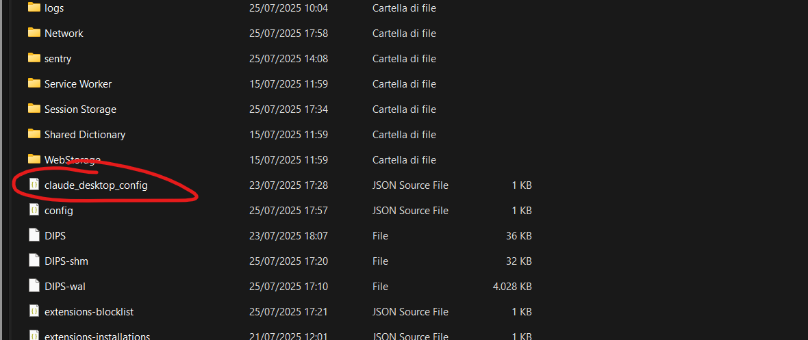
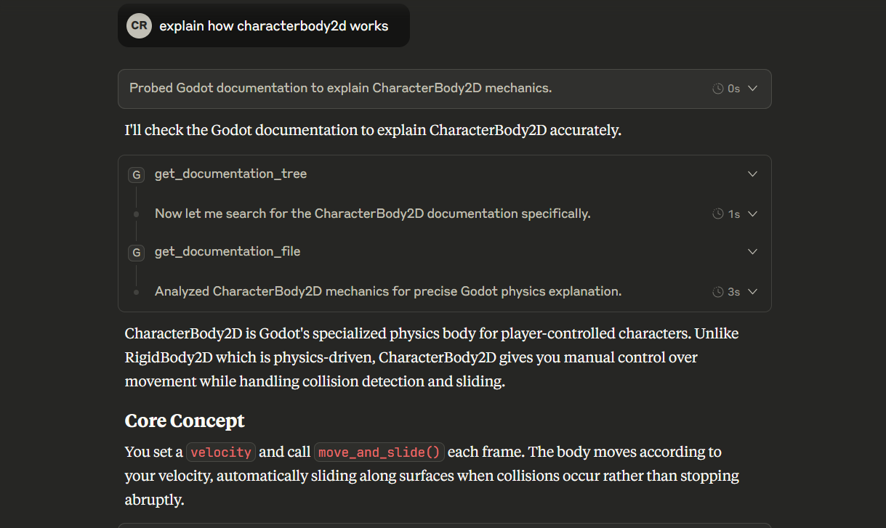

# Godot MCP Documentation Server

[](https://www.docker.com/)
[](https://godotengine.org/)
[](https://modelcontextprotocol.io/)
[](https://opensource.org/licenses/MIT)

A Model Context Protocol (MCP) server that provides AI assistants with access to the complete Godot Engine documentation, helping developers with Godot development by serving documentation directly to LLMs.

## Purpose

This server bridges the gap between AI assistants and Godot documentation, allowing developers to get instant, accurate answers about Godot classes, tutorials, and features without leaving their AI chat interface.

## Deployment

1. **Clone the repository:**
   ```bash
   git clone https://github.com/Nihilantropy/godot-mcp-docs.git
   cd godot-mcp-docs
   ```

2. **Build the Docker image:**
   ```bash
   docker build -f deploy/Dockerfile -t godot-mcp-docs:local .
   ```

3. **Configure your MCP client** (Claude Desktop example):
   ```json
   {
     "mcpServers": {
       "godot-mcp-docs": {
         "command": "docker",
         "args": [
           "run",
           "--rm",
           "-i",
           "godot-mcp-docs:local"
         ]
       }
     }
   }
   ```

## Documentation Structure

The server provides access to the complete official Godot documentation with this structure:

```
docs/
├── _styleguides
├── _tools
│   └── redirects
├── about
├── classes
├── community
│   └── asset_library
├── contributing
│   ├── development
│   │   ├── compiling
│   │   ├── configuring_an_ide
│   │   ├── core_and_modules
│   │   ├── debugging
│   │   │   └── vulkan
│   │   ├── editor
│   │   └── file_formats
│   ├── documentation
│   └── workflow
├── getting_started
│   ├── first_2d_game
│   ├── first_3d_game
│   ├── introduction
│   └── step_by_step
├── img
└── tutorials
    ├── 2d
    ├── 3d
    │   ├── global_illumination
    │   ├── particles
    │   └── procedural_geometry
    ├── animation
    ├── assets_pipeline
    │   ├── escn_exporter
    │   └── importing_3d_scenes
    ├── audio
    ├── best_practices
    ├── editor
    ├── export
    ├── i18n
    ├── inputs
    ├── io
    ├── math
    ├── migrating
    ├── navigation
    ├── networking
    ├── performance
    │   └── vertex_animation
    ├── physics
    │   └── interpolation
    ├── platform
    │   ├── android
    │   ├── ios
    │   └── web
    ├── plugins
    │   └── editor
    ├── rendering
    ├── scripting
    │   ├── c_sharp
    │   │   └── diagnostics
    │   ├── cpp
    │   ├── debug
    │   ├── gdextension
    │   └── gdscript
    ├── shaders
    │   ├── shader_reference
    │   └── your_first_shader
    ├── ui
    └── xr
```

## Available Tools

- `get_documentation_tree()` - Get a tree-style overview of the entire documentation structure
- `get_documentation_file(file_path: str)` - Retrieve the content of specific documentation files

## Sample Usage

**Explore documentation structure:**
```
What documentation is available for Godot?
```

**Get specific class documentation:**
```
Show me the documentation for CharacterBody2D
```

**Learn about tutorials:**
```
What tutorials are available for 2D game development?
```

**Get specific tutorial content:**
```
Show me the first 2D game tutorial
```

**Compare classes:**
```
What's the difference between Node2D and CharacterBody2D?
```

## Recommended System Prompt

For optimal results when working with Godot, use this system prompt:

> "When working with Godot game development questions, always search for the latest available documentation using the godot-mcp-docs tools. Start with `get_documentation_tree()` to understand the documentation structure, then use `get_documentation_file()` to retrieve specific information about classes, tutorials, or features. Prioritize official Godot documentation over general knowledge when providing Godot-related assistance."

## Screenshots

### MCP Integration in Claude Desktop


### Documentation Access Example


## Updating Documentation

To update to a newer version of Godot documentation:

**Option 1: Rebuild the image**
```bash
docker build -f deploy/Dockerfile -t godot-mcp-docs:local . --no-cache
```

**Option 2: Update manually inside container**
```bash
docker run -it --entrypoint /bin/bash godot-mcp-docs:local
# Inside container:
python docs_converter/godot_docs_converter.py
tree docs/. > docs/docs_tree.txt
```

## License

This project is licensed under the MIT License - see the [LICENSE](LICENSE) file for details.

The Godot documentation content follows the original Godot documentation licensing:
- Documentation content (excluding `classes/` folder): [CC BY 3.0](https://creativecommons.org/licenses/by/3.0/)
- Class reference files (`classes/` folder): MIT License
- Attribution: "Juan Linietsky, Ariel Manzur and the Godot community"